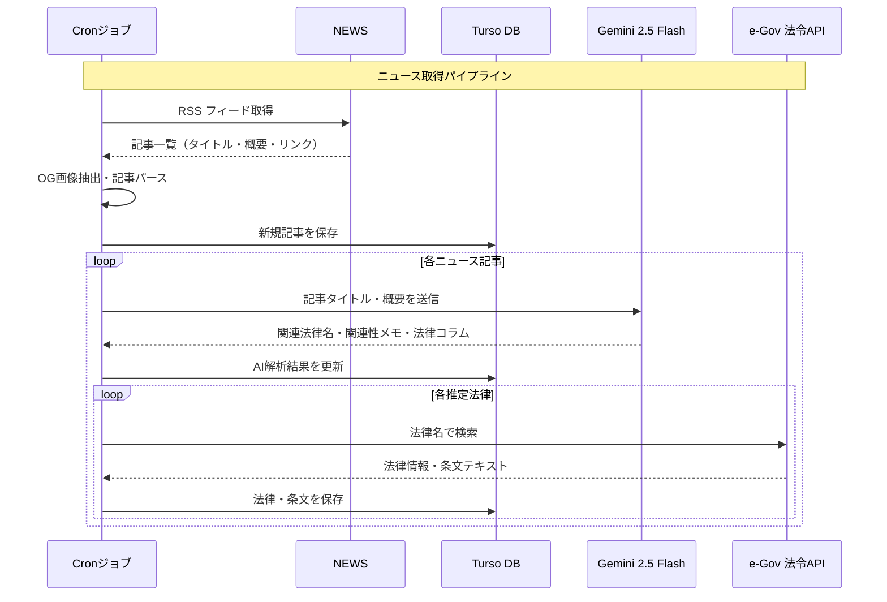

# ニュースでまなぶ！日本のルール

ニュース記事を取得し、AIが関連する日本の法律を推定・解説する教育Webアプリケーション

## 技術スタック

| レイヤー | 技術 |
|---------|------|
| フレームワーク | Next.js 16 (App Router) / React 19 / Tailwind CSS v4 / shadcn/ui |
| ORM | Drizzle ORM |
| データベース | Turso (LibSQL / サーバーレス SQLite) |
| AI | Vercel AI SDK + Google Gemini 2.5 Flash |

## セットアップ

```bash
# 依存関係のインストール
pnpm install

# 開発サーバー起動
pnpm dev

# 本番ビルド
pnpm build

# DBマイグレーション
pnpm drizzle:migrate
```

## ディレクトリ構成

```
app/          # Next.js App Router ページ
components/   # UIコンポーネント
data/         # データベースクエリ関数
db/           # Drizzle ORMスキーマ
hooks/        # カスタムReactフック
lib/          # ユーティリティ関数
types/        # TypeScript型定義
zod/          # Zodスキーマ
```

## ページ構成

- `/` - トップページ（ニュース一覧・検索・ページネーション）
- `/news/[id]` - ニュース記事詳細（関連法律・AI法律コラム表示）
- `/news/[id]/laws/[lawId]` - 法律詳細（法律情報・関連条文一覧）
- `/credits` - クレジットページ

## 外部サービス連携

| サービス | 役割 | 接続方式 |
|---------|------|---------|
| Google Gemini 2.5 Flash | 法律推定・コラム生成 | Vercel AI SDK |
| e-Gov 法令API | 法律の公式情報・条文取得 | REST API |
| Turso | データ永続化 | LibSQL (サーバーレス SQLite) |

## データフロー（ニュース取得パイプライン）


